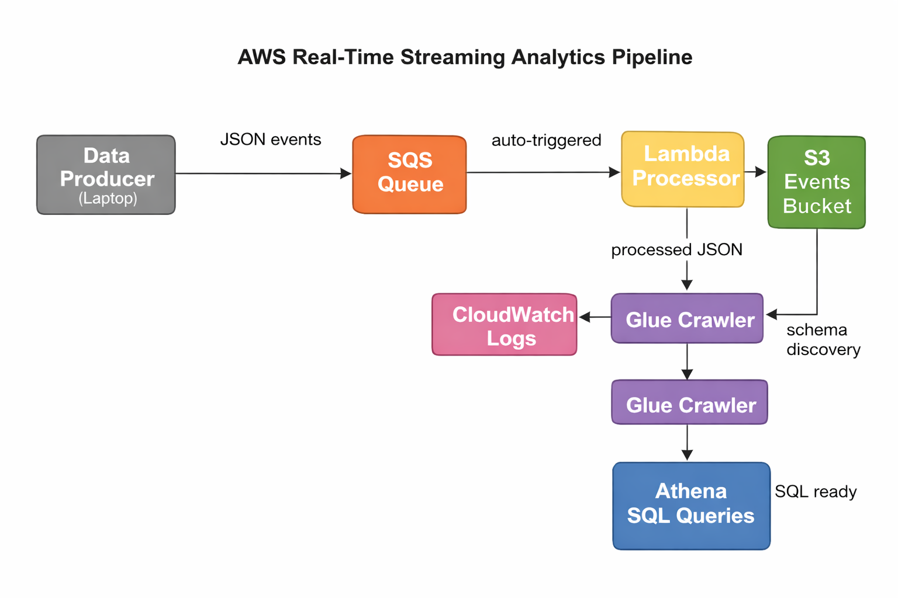

# AWS Real-Time Streaming Analytics Pipeline

A production-grade streaming analytics pipeline on AWS.
Ingests real-time user events, processes them serverlessly,
stores them in S3, and makes them queryable with SQL via Athena.

## Architecture



**Services Used:**

- SQS Queue — real-time event ingestion, fully free tier
- Lambda (Python 3.11) — auto-triggered message processor
- S3 — partitioned event storage (year/month/day)
- AWS Glue — automatic schema discovery and data catalog
- Athena — serverless SQL queries on S3 data
- CloudWatch — pipeline monitoring and alerting

## Live Demo

▶️ [Watch the full demo on YouTube](https://youtube.com/YOUR_VIDEO_URL)

## How It Works

1. `data_producer.py` simulates a website sending user events to SQS
2. SQS buffers events and triggers Lambda automatically on new messages
3. Lambda processes and enriches each event, saves to S3
4. Processed events land in S3 partitioned by date
5. Glue Crawler scans S3 and infers the schema automatically
6. Athena queries the data with standard SQL — no servers needed

## How to Deploy

```bash
git clone https://github.com/YOUR_USERNAME/aws-streaming-analytics-pipeline
cd aws-streaming-analytics-pipeline/terraform
terraform init
terraform apply
```

## How to Run

```bash
# Start sending events
python3 app/data_producer.py

# Then in AWS Console:
# 1. Glue → run the crawler
# 2. Athena → query your data with SQL
```

## Sample Queries

```sql
-- Events by type
SELECT event_type, COUNT(*) as count
FROM events GROUP BY event_type ORDER BY count DESC;

-- All purchases
SELECT user_id, product, amount FROM events
WHERE event_type = 'purchase' ORDER BY timestamp DESC;
```

## Destroy

```bash
terraform destroy
```

## Cost

- SQS: 1M requests/month free forever
- Lambda: 1M requests/month free
- S3: 5GB free tier
- Glue Crawler: ~$0.44/hour only while running (run once, stop)
- Athena: $5 per TB scanned (demo = essentially free)

## Skills Demonstrated

- Event-driven architecture (SQS + Lambda)
- Serverless stream processing
- Data lake design (S3 partitioning)
- Schema-on-read analytics (Glue + Athena)
- Infrastructure as Code (Terraform)
- CI/CD (GitHub Actions)
- CloudWatch monitoring and alerting
